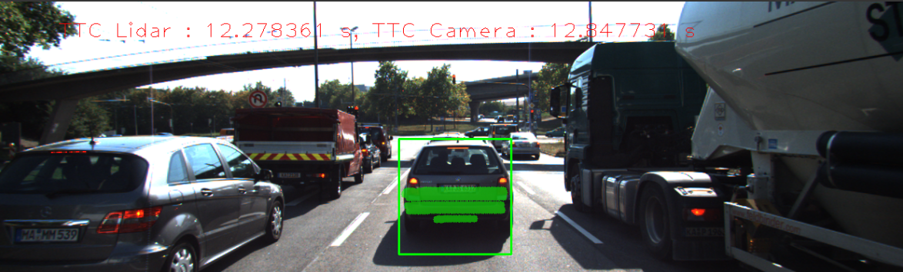

# 3D Object Tracking
## Dependencies
- PCL
- OpenCV
- Eigen

## Architecture


## Output


In this project, there four major tasks: 
1. First, matching 3D objects over time by using keypoint correspondences. 
2. Second, Computing time to collision (TTC) based on Lidar measurements. 
3. Computing TTC based the camera, which requires to first associate keypoint matches to regions of interest and then to compute the TTC based on those matches. 
4. And lastly, conducting various tests with the framework. Goal is to identify the most suitable detector/descriptor combination for TTC estimation based measurements by the camera or Lidar sensor. 


## Build Instructions
Make sure the system has C++ (>+11), and the dependencies mentioned above. 

1. Clone this repository:
```git clone https://github.com/mayankysharma/3D-Time-to-Collision-using-Sensor-Fusion.git```
2. Make a build directory in the top level project directory: `mkdir build && cd build`
3. Compile: `cmake .. && make`
4. download yolo.weights file in dat/yolo/
5. Run  the executable: `./3D_object_tracking`.
